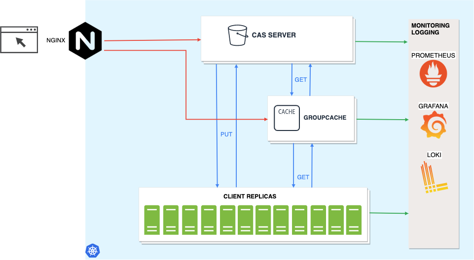
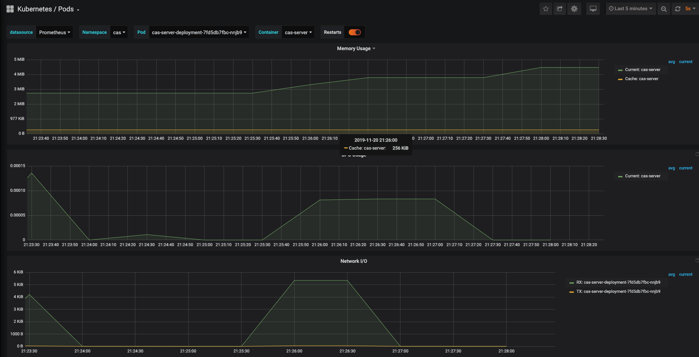
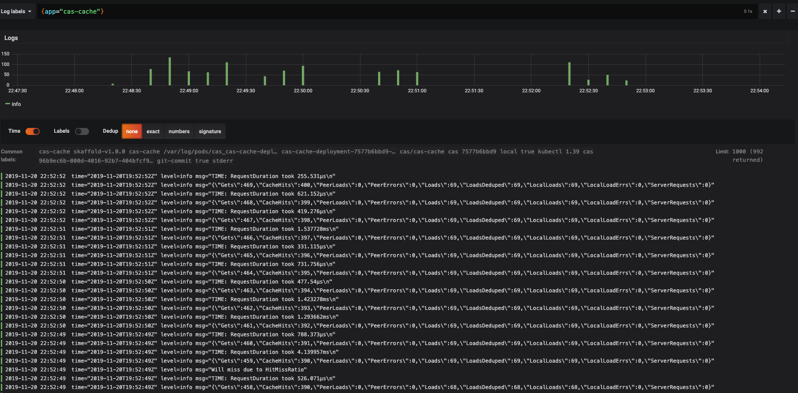

# Content Addressable Storage Test Harness 

What is this?
=========
This is a simple production-ready [content addressable storage](https://en.wikipedia.org/wiki/Content-addressable_storage) written with Golang. The main idea is effectively caching & load testing & load balancing & monitoring and orchestrating a production ready CAS system.

Architecture
=========
Used Kubernetes for deployment. Architecture is like below.



There are three main components in the project;

## CAS SERVER (./server)
It's a dummy server handling only GET and PUT requests.

PUT: Writes the coming multipart file to storage folder with the same name.
GET: Sends back the file as response.

## CAS CACHE (./cacheserver)
It's a caching layer between CAS-CLIENT and CAS-SERVER. This layer handles only GET requests and caches response with LRU cache for the next time. 

## CAS CLIENT (./client)
It's a load tester client using an external load testing library.

It sends a file to CAS-SERVER then starts to get the file from CACHE-SERVER with a load test for a while.

-----


## Technology Stack and External Libraries

***Orchestration & Deployment System*** : [Kubernetes](https://kubernetes.io/)

***Web Server to reach cluster*** : [Ingress-Ngnix](https://kubernetes.github.io/ingress-nginx/)

***Caching System*** : [Groupcache](https://github.com/golang/groupcache)

***Monitoring*** : [Prometheus](https://prometheus.io/docs/introduction/overview/) & [Grafana](https://grafana.com/)

***Logging*** : [Loki](https://grafana.com/oss/loki/) & [Logrus](https://github.com/Sirupsen/logrus)

***Load Test Library*** : [Vegeta](https://github.com/tsenart/vegeta)

***HTTP request router*** : [httprouter](https://github.com/julienschmidt/httprouter)

***Static Analysis Tool*** : [golangci-lint](https://github.com/golangci/golangci-lint)

---
## Notes About Technology Stack


* I used [httprouter](https://github.com/julienschmidt/httprouter) over Go's built-in HTTP library considering [this](https://github.com/julienschmidt/go-http-routing-benchmark) benchmark.

* I used [Groupcache](https://github.com/golang/groupcache) over Redis or Memcached. it's a client library as well as a server, no need any network layer to access. Groupcache is very easy to configure. No need to implement any LRU caching, cache eviction strategy etc...  There is the same peer system with memcached but Groupcache is a better fit for this kind of project.

* I used [Ingress-Ngnix](https://kubernetes.github.io/ingress-nginx/) only for reaching the services in the cluster. 

* I used [Vegeta](https://github.com/tsenart/vegeta) because of its great metrics. 

---
Setup & Run
=========

### Docker Setup
If you want to run the applications without Kubernetes you can simply run below.
```bash
./scripts/docker_start.sh
```

### Kubernetes Requirements

Before beginning the project setup, some technologies should be installed on your environment.

* [kubectl](https://kubernetes.io/docs/tasks/tools/install-kubectl/)
* [Minikube](https://kubernetes.io/docs/tasks/tools/install-minikube/) (if the environment is local)
* [Helm](https://helm.sh/docs/intro/install/)

### Kubernetes Setup

If the environment is Minikube we should enable ingress
```bash
./scripts/enable_ingress.sh
```

Applying and running the test
```bash
./scripts/apply_k8s.sh
```

Monitoring & Logging 
=========
We can download and apply Prometheus services with Helm.
```bash
./scripts/monitoring.sh
```

After that, you can make port-forwarding to Prometheus and Grafana. If you run these commands in different terminals you can access http://localhost:9090 for Prometheus and http://localhost:3000 for Grafana.

```bash
kubectl port-forward -n cas prometheus-caspromet-prometheus-opera-prometheus-0 9090
```

```bash
kubectl port-forward $(kubectl get  pods --selector=app=grafana -n  cas --output=jsonpath="{.items..metadata.name}") -n cas  3000
```

***If you run these services on production environment you have to expose them through kubernetes ingress.***

Now you can see our pods on Grafana UI like below.



I used Loki for logging. It's a datasource for Grafana. You can install with the link below.

[Loki Installation](https://github.com/grafana/loki/blob/master/docs/getting-started/grafana.md)

Then you can see your log stream of the selected pod.


After running your cluster you can watch the logs of Client and Cache-Server. 

After each test run **client** produces a metric json log like below

```Javascript
{
  "latencies": {
    "total": 955180430,
    "mean": 31839347,
    "50th": 2690564,
    "95th": 113631360,
    "99th": 505767288,
    "max": 505767288
  },
  "bytes_in": {
    "total": 750000,
    "mean": 25000
  },
  "bytes_out": {
    "total": 0,
    "mean": 0
  },
  "earliest": "2019-11-20T19:52:20.58307081Z",
  "latest": "2019-11-20T19:52:30.278686234Z",
  "end": "2019-11-20T19:52:30.303937234Z",
  "duration": 9695615424,
  "wait": 25251000,
  "requests": 30,
  "rate": 3.0941821316199927,
  "success": 1,
  "status_codes": {
    "200": 30
  },
  "errors": []
}
```

After each request **cache-server** produces a metric json log like below
```Javascript
{
  "Gets": 432,
  "CacheHits": 370,
  "PeerLoads": 0,
  "PeerErrors": 0,
  "Loads": 62,
  "LoadsDeduped": 62,
  "LocalLoads": 62,
  "LocalLoadErrs": 0,
  "ServerRequests": 0
}
```

You can watch logs and create alarms using these metrics.


Tests & Code Quality 
=========
You can run the tests with
```Go
go test ./... -cover -v 
```

You can make a static analysis with

```Go
golangci-lint run ./... --tests=false
```

Potential Improvements
=========

* Scaling and Parametrisation of Groupcache peer count. 
* TCP Raw connection between CacheServer and CasServer instead of HTTP
* CI/CD to deploy a Kubernetes Cloud environment   